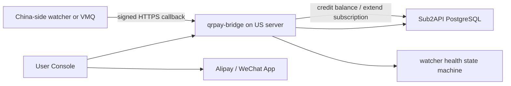

# Epay QR-Code Recharge And Subscription Closed Loop

This stack adds a `qrpay-bridge` service beside Sub2API. It follows the useful parts of `maajiko/Epay` instead of using EasyPay aggregation:

- `alipaycode`: the payment page opens Alipay transfer with exact amount and an order-number remark, then a watcher polls Alipay account logs and confirms the order.
- `onecode/paypage`: one fixed entry point creates an internal order first, then the user chooses a QR-code channel. Static QR-code payments are recognized by exact amount jitter, watcher callbacks, VMQ-style callbacks, or manual admin confirmation.

## What Was Borrowed From Epay

`plugins/alipaycode/inc/pay.page.php` uses `AlipayJSBridge.call("startApp", { appId: "20000123", param: { actionType: "scan", u, a, m } })`. The bridge mirrors that behavior at:

```text
https://YOUR_DOMAIN/qrpay/pay/{out_trade_no}
```

`plugins/alipaycode/server.php` is not a provider webhook. It is a polling worker:

```text
pending order -> query alipay.data.bill.accountlog.query -> match trans_memo + trans_amount -> processNotify
```

The bridge exposes the matching endpoint:

```text
POST /qrpay/api/watch/alipay-bill
Header: X-Qrpay-Secret: QRPAY_WATCHER_SECRET
```

`user/onecode.php` and `paypage/ajax.php` first create an internal order (`tid=3` in Epay), then jump to a selected channel. The bridge mirrors that by creating Sub2API-compatible `payment_orders` rows before showing QR-code payment.

## What Was Borrowed From Uptime Kuma

Full Uptime Kuma is not embedded in the payment path. Its useful part here is the monitor state machine:

```text
UP = 1
DOWN = 0
PENDING = 2

failure before max retries -> PENDING
failure after max retries -> DOWN
DOWN -> UP, UP -> DOWN, PENDING -> DOWN are important transitions
resend_interval repeats alerts while still DOWN
```

The bridge implements this smaller model for payment watchers:

```text
qrpay_bridge_monitors
qrpay_bridge_heartbeats
POST /qrpay/api/watch/heartbeat
GET  /qrpay/api/watch/status
```

Use this to know whether the China-side watcher is alive. It is better than hiding a failed poller until users complain about unpaid orders.

## US Server And Middle Layer

A US server can receive HTTPS callbacks as long as:

- `https://YOUR_DOMAIN/qrpay/...` is publicly reachable.
- Ports 80/443 are open.
- DNS and TLS are valid.
- Caddy routes `/qrpay/*` to `qrpay-bridge`.

The bigger issue is not inbound callbacks to the US. It is how the payment signal is obtained:

- Alipay `alipaycode` has no normal payment callback. It needs account-log polling with app credentials. Polling from the US may work, but for stability a China-side watcher is recommended.
- WeChat personal/static collection QR codes do not provide an official server callback. Automated recognition needs a middle layer such as VMQ, a phone/PC watcher, a domestic VPS watcher, or manual confirmation.
- Official merchant Alipay/WeChat callbacks can reach a US server, but that is not the "personal no-sign QR code" model requested here.

Recommended production topology:



## Order Flow

Recharge:

```text
User -> /purchase -> create payment_orders row
Bridge -> generate pay_url and QR
User -> pays exact pay_amount
Watcher -> POST bill/receipt callback
Bridge -> idempotently marks order PAID
Bridge -> credits users.balance and total_recharged
Bridge -> marks order COMPLETED
```

Subscription:

```text
User -> /subscriptions -> selects subscription_plans row
Bridge -> create payment_orders row with plan_id, group_id, subscription_days
Watcher -> confirms payment
Bridge -> extends or creates user_subscriptions
Bridge -> marks order COMPLETED
```

## Configuration

Edit `cloud-deploy/.env`:

```text
QRPAY_ENABLE_ALIPAY_CODE=true
QRPAY_ALIPAY_USER_ID=your-alipay-user-id
QRPAY_ENABLE_WECHAT_CODE=true
QRPAY_WECHAT_QR_IMAGE_URL=https://YOUR_DOMAIN/path/to/wechat-qr.png
QRPAY_WATCHER_SECRET=long-random-string
QRPAY_ADMIN_SECRET=long-random-string
QRPAY_AMOUNT_JITTER_METHODS=wechat_code
QRPAY_AMOUNT_JITTER_CENTS=50
```

If using VMQ-style callbacks:

```text
QRPAY_VMQ_KEY=vmq-shared-key
```

If using alerting for watcher health:

```text
QRPAY_ALERT_WEBHOOK_URL=https://your-alert-endpoint
QRPAY_ALERT_WEBHOOK_SECRET=optional-shared-secret
```

Deploy:

```bash
cd /opt/sub2api-nvidia/cloud-deploy
docker compose up -d --build
docker compose ps
```

## Alipay Account-Log Watcher

Install the optional watcher dependencies on the machine that can reliably reach Alipay OpenAPI:

```bash
cd cloud-deploy/qrpay-bridge/watchers
python3 -m venv .venv
. .venv/bin/activate
pip install -r requirements.txt
```

Run:

```bash
export QRPAY_BRIDGE_URL="https://YOUR_DOMAIN/qrpay"
export QRPAY_WATCHER_SECRET="same-as-QRPAY_WATCHER_SECRET"
export ALIPAY_APP_ID="your-app-id"
export ALIPAY_APP_PRIVATE_KEY="your-app-private-key"
export ALIPAY_PUBLIC_KEY="alipay-public-key"
export ALIPAY_APP_AUTH_TOKEN="optional-app-auth-token"
python alipay_accountlog_watcher.py
```

The watcher polls `alipay.data.bill.accountlog.query` every 3 seconds, forwards `detail_list` to the bridge, and sends heartbeat reports.

## WeChat Static QR-Code Recognition

For WeChat personal/static QR-code payments, choose one:

- VMQ-style watcher: send signed callbacks to `POST /qrpay/api/webhook/vmq`.
- Windows watcher: run `cloud-deploy/qrpay-bridge/watchers/wechat_windows_watcher.py` on the PC that logs into the receiving WeChat account. See `docs/windows-wechat-watcher.md`.
- Custom watcher: send receipts to `POST /qrpay/api/watch/wechat-receipt`.
- Manual fallback: call `POST /qrpay/api/admin/orders/{out_trade_no}/confirm`.

`wechat-receipt` accepts either an explicit `out_trade_no` or a unique `amount`. If no order number is provided, the bridge only confirms when exactly one pending WeChat order has that payment amount. This is why `QRPAY_AMOUNT_JITTER_METHODS=wechat_code` is enabled by default.

Example custom watcher payload:

```json
{
  "out_trade_no": "zqr_20260517abc123",
  "amount": "10.03",
  "transaction_id": "wechat-receipt-id",
  "payer": "optional payer label"
}
```

## Watcher Health

Watcher heartbeat:

```bash
curl -X POST "https://YOUR_DOMAIN/qrpay/api/watch/heartbeat" \
  -H "Content-Type: application/json" \
  -H "X-Qrpay-Secret: ${QRPAY_WATCHER_SECRET}" \
  -d '{"name":"wechat-receipt","kind":"wechat","ok":true,"msg":"watcher alive"}'
```

Admin status:

```bash
curl "https://YOUR_DOMAIN/qrpay/api/watch/status" \
  -H "X-Qrpay-Secret: ${QRPAY_ADMIN_SECRET}"
```

When no heartbeat arrives within `QRPAY_WATCHER_STALE_AFTER_SECONDS`, the monitor moves through `PENDING` and then `DOWN`, following the Uptime Kuma retry model.

## Local Safety And Backup

The normal backup script now includes:

```text
cloud-deploy/qrpay-bridge
cloud-deploy/public/inject
cloud-deploy/docker-compose.yml
cloud-deploy/Caddyfile
```

Run:

```bash
cd cloud-deploy
./scripts/backup.sh
```

Backups include secrets if `.env`, `secrets/`, or Caddy data are included. Store them privately.
